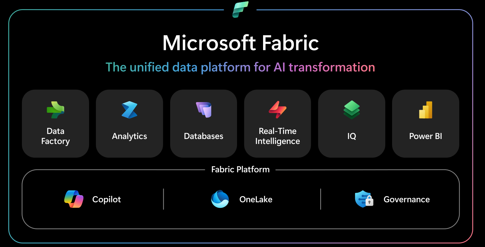

# Network Rail × Microsoft Fabric Hackathon 🚂

One day. Four teams. One Fabric workspace each. A real-ish Network Rail dataset that needs some work — and a whole platform to build on. ⚡

You'll go from raw files to a working solution end-to-end: **ingest → transform → model → report → (optional) AI**. Pick your own path through Fabric, try something you've never used before, and end the day with something you'd actually show a stakeholder.

**Focus workloads:** Data Factory · Lakehouse · Power BI · AI 🤖
**Out of scope:** Real-Time Intelligence · Fabric SQL DB · Data Science / ML

*Image credit: [Microsoft Learn — What is Microsoft Fabric?](https://learn.microsoft.com/fabric/fundamentals/microsoft-fabric-overview)*

---

## Agenda

| Time | Slot |
|---|---|
| 10:00 – 10:20 | Welcome and framing |
| 10:20 – 10:45 | Fabric refresher and workspace tour |
| 10:45 – 11:00 | Team huddle and dataset reveal |
| 11:00 – 12:30 | Hacking time |
| 12:30 – 13:15 | Lunch |
| 13:15 – 15:30 | Hacking time |
| 15:30 – 15:45 | Break |
| 15:45 – 16:30 | Team demos |
| 16:30 – 17:00 | Wrap-up and open Q&A |

Timings are indicative — flex where it makes sense.

---

## How the day works

- Each team is assigned **one scenario** and one dataset.
- Each team has **one Fabric workspace** and can work on multiple items in parallel — split the work across ingestion, transformation, modelling, reporting, and (if AI is enabled) an AI experience.
- You get **goals and stretch goals**, not step-by-step instructions. Pick your path through Fabric.
- The data is **imperfect on purpose**. Expect to clean, reshape, and question it.
- Use the [Method Menus](./Method-Menus.md) to pick tools for each stage — there's more than one right answer.

### The demo (5 minutes per team)

At the end of the day each team presents. The demo should cover:

- **What you built** — a short walk-through of your solution end-to-end.
- **What you learned** — especially any Fabric capabilities you tried for the first time.
- **How this translates to a day-to-day task** at Network Rail — where would this pattern actually be useful?
- **What you'd improve next** — if you had another day, what would you do differently or add?

---

## Goals for the day

Work through these in order. Anything beyond is a bonus.

1. **Land the data.** Get your raw files into your team's lakehouse using at least one method (see [Method Menus](./Method-Menus.md#ingestion)).
2. **Clean and model.** Produce cleaned tables with correct types and working relationships. Keep a short note of what you changed and why.
3. **Build a report.** A Power BI report that answers the questions in your scenario, with at least a KPI page, a diagnostics page, and a drill-through or detail page.
4. **Try something new.** Use at least one Fabric capability you haven't used before — a pipeline pattern, notebook, dataflow, Copilot feature, semantic model tweak. The point is to explore.
5. **Bring Copilot into the flow.** Use **Copilot in Power BI** to draft a report page or write a narrative summary, and/or **Copilot in a Fabric notebook** to generate PySpark or Spark SQL for cleaning and transforming your data. (Fabric Data Agent is not available on the day.)

---

## Stretch goals

Pick any that sound interesting:

- Use **two different ingestion methods** and explain the trade-off.
- Build a **medallion architecture** (bronze / silver / gold) with clear layer separation.
- Implement **incremental refresh** via a parameterised pipeline.
- Add **data quality checks** as part of your pipeline — row counts, null thresholds, referential integrity.
- Publish your workspace as a **Fabric App**, or embed a report in a **Teams channel**.
- Add **row-level security** by Region to the semantic model.

---

## Method menus

For each stage of the day, there's more than one Fabric tool that will do the job. The [Method Menus](./Method-Menus.md) file lists the main options for **ingestion**, **transform and modelling**, and **consume** — with links to the Microsoft Learn documentation for each.

---

## Teams and themes

Each team gets a scenario, a business question to answer, and a folder of files inside [`datasets/`](./datasets/) plus the shared `calendar.csv`.

> **The data is imperfect on purpose.** Expect casing quirks, missing values, mixed types, and joins that need care. Full schema and specific data quality quirks per team are in [`datasets/README.md`](./datasets/README.md) — read your team's section before you start.

### Team 1 — Rail Performance

- **Theme:** train punctuality, delays, and cancellations across routes, operators, and regions.
- **Files:** [`datasets/rail_performance/`](./datasets/rail_performance/) — `services.csv`, `delay_events.csv`, `cancellations.csv`, `routes.csv`, `operators.csv`, `regions.csv` + shared `calendar.csv`.
- **Questions to answer:**
  - Which routes and operators have the worst on-time performance, and how has that changed over time?
  - What are the main causes of delay, and which cause the most cumulative delay minutes?
  - When and where are cancellations most likely to happen?

### Team 2 — Safety Incidents

- **Theme:** workplace safety incidents across stations, depots, and track sections, with corrective actions and hours worked.
- **Files:** [`datasets/safety_incidents/`](./datasets/safety_incidents/) — `incidents.csv`, `corrective_actions.csv`, `locations.csv`, `hours_worked.csv`, `regions.csv` + shared `calendar.csv`.
- **Questions to answer:**
  - Where are our safety hotspots, and are certain incident types concentrated by location or department?
  - How does the incident rate look when normalised by hours worked, rather than raw counts?
  - How effective are corrective actions — how many are closed on time, and how long do they typically take?

### Team 3 — Track Possessions

- **Theme:** planned track possessions for maintenance and renewal, and how they perform against plan.
- **Files:** [`datasets/track_possessions/`](./datasets/track_possessions/) — `possessions.csv`, `impacts.csv`, `contractors.csv`, `locations.csv`, `regions.csv` + shared `calendar.csv`.
- **Questions to answer:**
  - Which possession types and reasons overrun most often, and by how much?
  - Which contractors are the most and least reliable, and does this change by region or type?
  - How do overrunning possessions impact services — cancellations and delay minutes?

### Team 4 — Fleet Operations

- **Theme:** fleet availability, failures, and maintenance across depots and fleet types.
- **Files:** [`datasets/fleet_operations/`](./datasets/fleet_operations/) — `availability_snapshots.csv`, `failures.csv`, `maintenance_workorders.csv`, `fleet_units.csv`, `depots.csv`, `regions.csv` + shared `calendar.csv`.
- **Questions to answer:**
  - Which depots and fleet types have the best availability, and how is it trending?
  - What's driving downtime — failures or planned maintenance?
  - Are there fleet units or depots that stand out for repeated failures or long maintenance turnarounds?

---

Have fun. Ask questions. Break things. Show us what you build. 🎉
